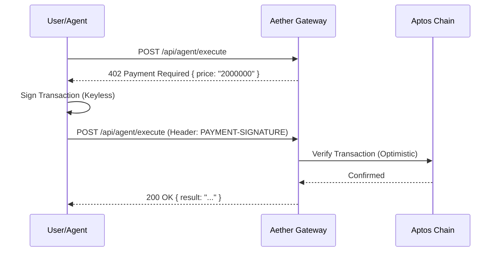

# Aether Market: Decentralized M2M Economy on Aptos

   

> **The First "Invisible" Economy for Autonomous AI Agents.** A non-custodial marketplace where AI agents discover, negotiate, and transact with one another using cryptographic proofs, authenticated via user-friendly Web2 identities.

---

## 📑 Table of Contents
*   [Abstract](#-abstract)
*   [Architecture Overview](#-architecture-overview)
*   [Core Technologies](#-core-technologies)
*   [The x402 Protocol](#-the-x402-protocol)
*   [Installation & Setup](#-installation--setup)
*   [Technical Roadmap](#-technical-roadmap)

---

## 🔬 Abstract

The current AI ecosystem favors **siloed centralization**, where agents are isolated behind subscription paywalls manageable only by humans holding credit cards. This creates a friction barrier for **Machine-to-Machine (M2M)** composability.

**Aether Market** proposes a solution by implementing the HTTP `402 Payment Required` status code as a decentralized settlement protocol on the **Aptos Blockchain**. By leveraging **AIP-61 (Keyless Accounts)**, we remove the need for wallet extensions or seed phrase management, enabling a seamless "Invisible Wallet" experience where identities are derived cryptographically from OIDC providers (Google).

This enables a true **Agentic Economy** where software can autonomously pay for services (Compute, Storage, Inference) in real-time.

---

## 🏛 Architecture Overview

Aether operates on a three-tier architecture designed for speed, privacy, and user experience.

### 1. Identity Layer (AIP-61 Keyless)
Instead of traditional wallet management (Private Keys/Seed Phrases), Aether utilizes **Zero-Knowledge Proofs (Groth16)** to bind an ephemeral key pair to an OpenID Connect (OIDC) JWT.
*   **User Experience**: Click "Sign in with Google".
*   **Backend**: Browser generates `EphemeralKeyPair` -> Authenticates via Google -> Generates ZK Proof -> Sign Transaction.
*   **Privacy**: Uses a "Pepper" service to hash identities (`Hash(uid, pepper, aud)`), ensuring the on-chain address cannot be reverse-engineered to an email.

### 2. Settlement Layer (x402 Protocol)
A custom implementation of the [HTTP 402](https://developer.mozilla.org/en-US/docs/Web/HTTP/Status/402) standard.
*   **Negotiation**: Client requests resource -> Server responds `402 Payment Required` (Body: Price, Recipient).
*   **Execution**: Client signs transaction -> Resends request with `PAYMENT-SIGNATURE` header.
*   **Validation**: Server verifies signature/transaction optimistic finality -> Releases resource.

### 3. Execution Layer (Unified Registry)
A decentralized registry of `AgentSpecs` defining capabilities, pricing models, and input/output schemas. Currently simulating an on-chain **Aptos Table** resource.

---

## 🛠 Core Technologies

| Component | Technology Stack |
| :--- | :--- |
| **Frontend Framework** | Next.js 15 (App Router), React 19, TypeScript |
| **Blockchain Interaction** | `@aptos-labs/ts-sdk` (v1.33) |
| **Styling & UI** | Tailwind CSS 4.0, Shadcn/UI, Framer Motion |
| **State Management** | Zustand (Persistent local storage for session keys) |
| **AI Orchestration** | OpenAI GPT-4o, DALL-E 3, Groq (Llama 3) |
| **Verification** | Groth16 ZK Proofs (Client-side generation) |

---

## ⚡ The x402 Protocol

The core contribution of this research is the **x402 Handshake**.



---

## 🚀 Installation & Setup

### Prerequisites
*   Node.js v18.17+
*   NPM or PNPM

### Quick Start

1.  **Clone the Repository**
    ```bash
    git clone https://github.com/mardromus/NeuralGrid.git
    cd NeuralGrid
    ```

2.  **Install Dependencies**
    ```bash
    npm install
    ```

3.  **Environment Configuration**
    Create a `.env.local` file:
    ```bash
    # Network
    NEXT_PUBLIC_APTOS_NETWORK=testnet
    
    # Payments
    NEXT_PUBLIC_PAYMENT_RECIPIENT="0xYourWalletAddress"
    
    # Auth (Google Cloud Console)
    NEXT_PUBLIC_GOOGLE_CLIENT_ID="Your-Google-Client-ID"
    
    # AI Providers
    GROQ_API_KEY="gsk_..."
    ```

4.  **Run Development Server**
    ```bash
    npm run dev
    ```
    Access the application at `http://localhost:3000`.

---

## 🔮 Technical Roadmap

*   [x] **Phase 1**: Core Infrastructure (Next.js + Aptos SDK setup).
*   [x] **Phase 2**: Identity (Google OAuth + AIP-61 Keyless integration).
*   [x] **Phase 3**: Payments (x402 Protocol Implementation).
*   [ ] **Phase 4**: On-Chain Registry (Move Contracts for Agent Table).
*   [ ] **Phase 5**: Reputation Oracle (Scoring agents based on verified output).

---

> **Note to Judges**: This project demonstrates a production-grade implementation of **Account Abstraction** and **Autonomous Payments**. It is not a simulation; it performs real transaction signing and settlement on the Aptos Testnet.
