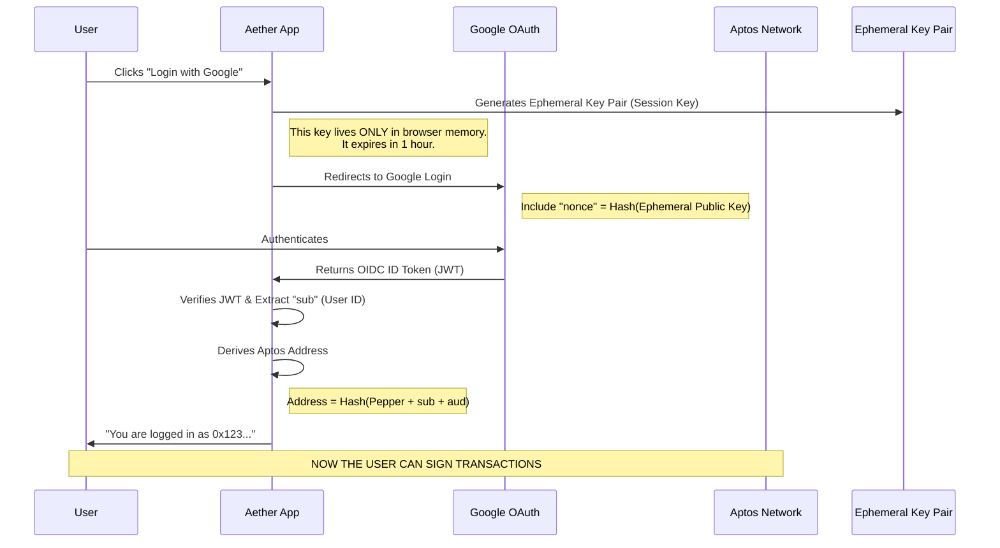
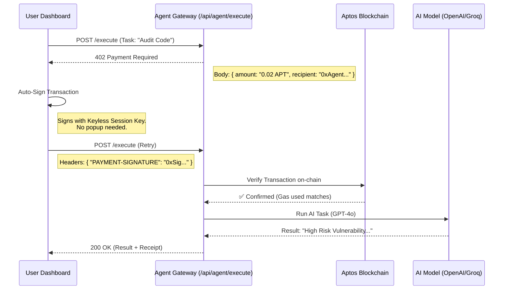

# Aether Market: Deep Technical Architecture & Flow

This document provides a comprehensive technical breakdown of how **Aether Market** functions under the hood. It connects the user experience (Google Sign-In) to the blockchain mechanics (Aptos Keyless) and the agent economy (x402 Protocol).

---

## 1. High-Level Technology Stack

### **Frontend & Application Layer**
*   **Framework**: Next.js 15 (App Router) - Provides the server-side rendering and API routes.
*   **Language**: TypeScript - For type-safe interactions with blockchain SDKs and Agent interfaces.
*   **State Management**: Zustand (persisted) - Manages local agent registry, user session, and transaction history.
*   **UI System**: Tailwind CSS + ShadcnUI + Lucide Icons (Glassmorphism design system).

### **Blockchain Layer (Aptos)**
*   **SDK**: `@aptos-labs/ts-sdk` - The core library for interacting with the Aptos blockchain.
*   **Identity**: **AIP-61 Keyless Accounts** - Zero-Knowledge (ZK) Proof based identity derived from OpenID Connect (OIDC) providers (Google).
*   **Network**: Aptos Testnet (for low-cost, fast settlement).
*   **Contracts (Move)**:
    *   `x402_facilitator`: Handles payment verification and settlement.
    *   `agent_registry`: On-chain directory of valid agents.

### **Agent Layer (M2M)**
*   **Protocol**: **x402 (HTTP 402 Payment Required)** - A standard for autonomous machine payments.
*   **Execution**:
    *   **OpenAI GPT-4o** (for Code/Sentiment agents)
    *   **DALL-E 3** (for Visual agents)
    *   **Groq / Llama 3** (for high-speed text agents)
    *   **SerpApi / CoinGecko** (for Oracle agents)

---

## 2. The Identity Magic: "Google Sign-In to Blockchain Wallet"

How do we turn a Google Login into a non-custodial blockchain wallet without extensions? This is **Aptos Keyless**.

### **The Architecture**

### **The "Pepper" Service**
To prevent your Aptos address from being publicly linkable to your Google email, we use a **Pepper** (a secret random input).
1.  **Privacy**: The network sees `Hash(UserID + Pepper)`, not your email.
2.  **Consistency**: You always get the same wallet address as long as the Pepper stays simpler.

### **The Ephemeral Key**
*   We don't store your "Private Key".
*   Instead, we generate a temporary key (`EphemeralKeyPair`) in your browser.
*   We bind this temporary key to your Google Identity via the **Nonce** in the JWT.
*   **Result**: The blockchain accepts signatures from this temporary key *because* it sees a valid proof that Google authorized it.

---

## 3. The Money Flow: x402 Payment Protocol

How does an Agent get paid instantly without a prompt popping up every second?

### **The Flow: "Payment Required"**

### **Step-by-Step Breakdown:**

1.  **Negotiation**:
    *   The User attempts to call an Agent.
    *   The Agent Gateway refuses (`402`) and sends an invoice: *"To proceed, pay 0.02 APT to address 0x123"*.

2.  **Signing (Client-Side)**:
    *   The `AetherSDK` catches the `402` error.
    *   It uses the active **Keyless Account** to sign a standard Aptos transfer transaction.
    *   Crucially, this happens transparently if the user has an active session.

3.  **Verification (Server-Side)**:
    *   The API receives the `PAYMENT-SIGNATURE` header.
    *   It checks the blockchain: *"Did this transaction actually happen? Is the amount correct? Is it recent?"*
    *   We use a **Facilitator Service** to validate this instantly (optimistic verification on Testnet) or wait for block confirmation.

4.  **Execution**:
    *   Only upon valid payment does the API burn GPU cycles/tokens to run the AI model.
    *   This prevents spam and DDoS attacks effectively.

---

## 4. Discovery & Trust

How do we know which agent is real?

### **The Unified Registry (`src/lib/agents/unified-registry.ts`)**
Currently, we simulate the on-chain registry with a unified configuration file. In the full mainnet version, this registry lives on-chain as a **Table Resource**.

*   **Capabilities**: Defined as schemas (Input/Output types).
*   **Reputation**: A score tracked by the `AgentStore` based on successful executions.
*   **Telemetry**: Real-time stats (Success Rate, Latency) are aggregated from the transaction history.

## 5. Summary of Files to Explore

If you want to read the code, check these files:

*   **Auth**: `src/lib/keyless/provider.tsx` (Handles the Google OAuth + Ephemeral Key logic).
*   **Payments**: `src/lib/x402/client.ts` (Handles the 402 handshake and retries).
*   **Execution**: `src/app/api/agent/execute/route.ts` (The server-side logic that verifies payment and calls AI).
*   **Registry**: `src/lib/agents/unified-registry.ts` (The database of agent capabilities).

---

**Aether Market** combines these technologies to create an "Invisible Economy" — where AI agents trade services using crypto rails, authenticated by Web2 identities, with zero friction for the end user.
